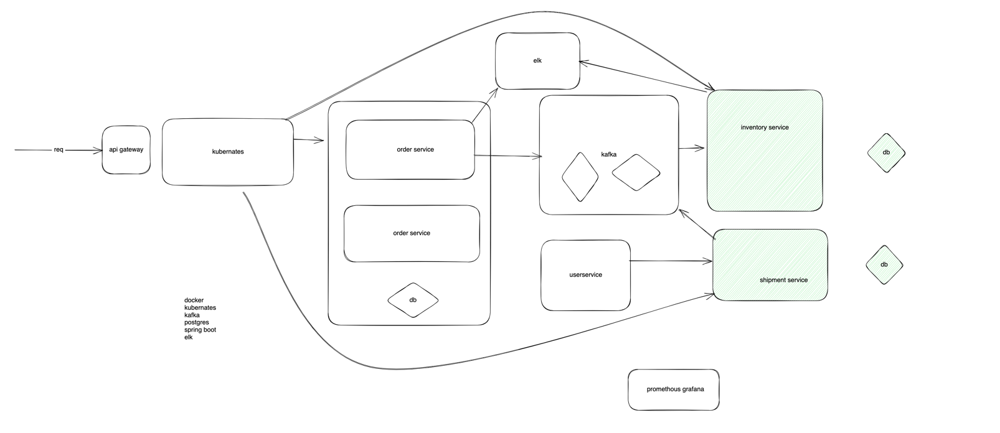

inventory-service

DB,

item_details
id int,
item_name string ,
desc string,
total_qty,
sold_qty,
supplier_desc

start docker
docker run -p 5432:5432 --name postgres  -e POSTGRES_PASSWORD=postgres -d postgres

docker exec -it 103929fe07b5 psql -U postgres

docker run -d --name elasticsearch  -p 9200:9200 -p 9300:9300 -e "discovery.type=single-node" elasticsearch

docker run  --network="host"  inventory-service

CREATE DATABASE shipment;

CREATE DATABASE inventory;

CREATE DATABASE orders;

# kafka

docker run -p 9092:9092 apache/kafka:3.7.1

